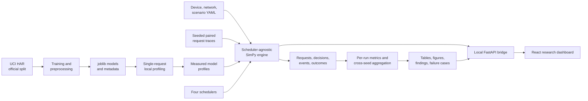
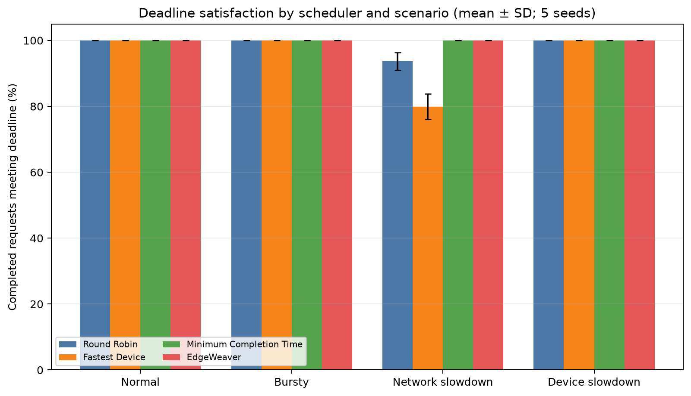
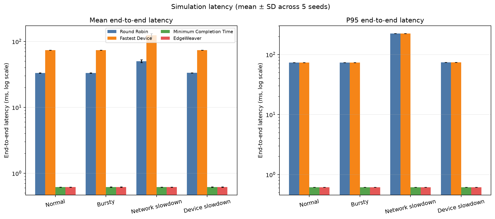
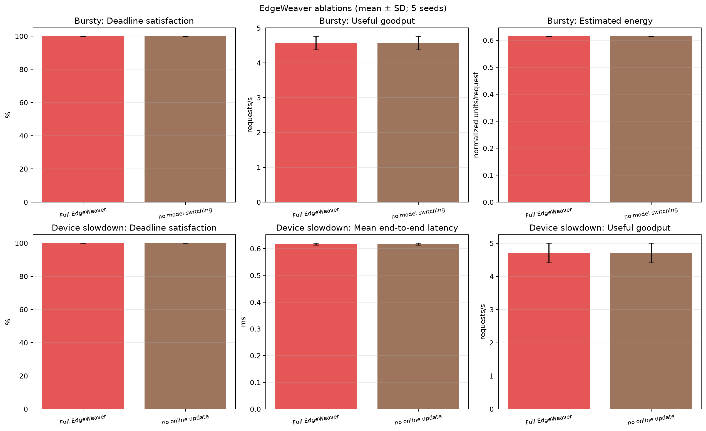

<div align="center">

# EdgeWeaver

**A reproducible research prototype for ML inference scheduling across simulated heterogeneous edge devices.**


[Overview](#overview) · [Architecture](#architecture) · [Methodology](#experimental-methodology) · [Results](#verified-results) · [Report](docs/report.md)

</div>

## Overview

EdgeWeaver evaluates how interactive machine-learning inference requests should be assigned across
heterogeneous edge resources. It combines reproducibly trained models with deterministic
discrete-event simulation, four scheduling policies, controlled workload conditions, per-request
event traces, and a local inspection dashboard.

> **Scope.** Model quality, artifact size, and single-request inference latency were measured on one
> computer. Mobile, gateway, and edge-server behavior—including networking, queueing, slowdowns, and
> energy—is simulated. This repository does not implement or claim production edge infrastructure.

## Research question

How should an inference request be assigned to a device and model when its relative deadline and
minimum-accuracy requirement must be balanced against queue state, network transfer time, model
execution time, and estimated energy?

The study evaluates five hypotheses concerning burst congestion, completion-time scheduling, model
switching, estimated energy, and online latency adaptation. Hypotheses are evaluated against the
observed runs rather than assumed to hold; the completed experiment supports only some of the
intended contrasts.

## What the project does

1. Downloads and validates the official UCI Human Activity Recognition Using Smartphones dataset,
   preserving its predefined train/test split.
2. Trains logistic-regression, random-forest, and multilayer-perceptron classifiers with saved,
   reproducible preprocessing.
3. Measures held-out accuracy, macro F1, artifact size, and local single-request latency.
4. Uses the measured model profiles as immutable inputs to a SimPy simulation of three devices and
   two remote links.
5. Replays seeded UCI HAR request traces through Round Robin, Fastest Device, Minimum Completion
   Time, and EdgeWeaver schedulers.
6. Exports structured decisions, lifecycle events, per-request results, aggregate metrics, figures,
   ablations, and failure-case evidence.
7. Exposes the same Python research core and saved outputs through a local FastAPI and React
   dashboard.

## Architecture



The main responsibility boundaries are:

| Layer             | Responsibility                                                                           | Implementation                                                               |
| ----------------- | ---------------------------------------------------------------------------------------- | ---------------------------------------------------------------------------- |
| ML                | Dataset validation, preprocessing, training, profiling, artifact reload                  | `edgeweaver/ml/`                                                             |
| Workload/scenario | Seeded held-out samples, deadlines, accuracy constraints, slowdown schedules             | `edgeweaver/scenarios.py`, `edgeweaver/workloads.py`                         |
| Simulation        | SimPy clock, resources, bounded queues, transfers, execution, prediction, energy, events | `edgeweaver/engine.py`                                                       |
| Scheduling        | Shared candidate estimates and policy-specific assignment decisions                      | `edgeweaver/schedulers/`                                                     |
| Measurement       | Per-run metrics, aggregation, figures, findings, failure-case extraction                 | `edgeweaver/metrics.py`, `edgeweaver/analysis.py`, `edgeweaver/reporting.py` |
| Interface         | Local API over package logic and a five-view research dashboard                          | `api/`, `frontend/`                                                          |

### Technology stack

- Python 3.12+, SimPy, Pydantic, PyYAML
- NumPy, pandas, scikit-learn, joblib
- Matplotlib for saved research figures
- FastAPI and Uvicorn for the local interface bridge
- React 19, TypeScript, and Vite for the dashboard
- pytest, Ruff, mypy, Vitest, and Testing Library for verification

## System and scheduling model

The official UCI HAR split contains 7,352 training and 2,947 held-out test samples, each with 561
engineered accelerometer/gyroscope features and one of six activity labels. Saved models are reloaded
to produce the actual prediction for each simulated request; profile accuracy is used only as the
scheduler's eligibility estimate.

| Role     | Stable model ID          | Test accuracy | Macro F1 | Artifact size | Measured mean / P95 latency |
| -------- | ------------------------ | ------------: | -------: | ------------: | --------------------------: |
| Light    | `logistic-regression-v1` |        95.49% |   95.48% |      25,661 B |            0.246 / 0.336 ms |
| Balanced | `random-forest-v1`       |        92.84% |   92.64% |   2,568,840 B |          12.660 / 14.896 ms |
| Heavy    | `mlp-v1`                 |        94.57% |   94.58% |   1,858,312 B |            0.336 / 0.372 ms |

Latency was measured on the local Windows profiling computer using 20 untimed warm-ups followed by
500 seeded, one-sample `transform` + `predict` measurements per model with
`time.perf_counter_ns()`. The complete environment record is in
[`artifacts/profiles/profiling_environment.json`](artifacts/profiles/profiling_environment.json).

The simulator defines three single-capacity resources in [`configs/devices.yaml`](configs/devices.yaml):

| Device      | Speed multiplier | Active power units | Waiting slots | Supported model roles  |
| ----------- | ---------------: | -----------------: | ------------: | ---------------------- |
| Mobile      |              2.5 |                1.0 |            20 | light, balanced        |
| Gateway     |              1.3 |                2.0 |            40 | light, balanced, heavy |
| Edge server |              0.6 |                4.0 |            80 | light, balanced, heavy |

Simulated service time is the stored measured mean multiplied by the selected device's speed factor.
Mobile execution has zero network delay. The gateway link uses 12 ms one-way base latency and
20 Mbps bandwidth; the edge-server link uses 35 ms and 10 Mbps. Transfer time is base latency plus
payload bits divided by bandwidth. Estimated energy is reported only in normalized units:

```text
compute = active power units × simulated inference time (ms)
network = transferred kilobytes × 0.02 normalized units/kB
```

All schedulers implement the same interface and receive the same read-only simulation state:

- **Round Robin:** rotates through compatible devices and uses the selected device's fastest model
  that meets the request's minimum profile accuracy; queue and network state do not select the
  device.
- **Fastest Device:** chooses the device with the lowest isolated inference time, then that device's
  highest-accuracy compatible model; it intentionally ignores congestion and end-to-end network
  cost.
- **Minimum Completion Time (MCT):** chooses the accuracy-eligible, queue-admissible device/model
  pair with the earliest predicted absolute completion, including upload, queued work, inference,
  return, and scheduler overhead.
- **EdgeWeaver:** among candidates predicted to meet the deadline, chooses lowest estimated energy,
  with completion time and stable IDs as tie-breakers. If none is feasible, it chooses earliest
  completion. After execution, it updates only the selected device/model latency estimate using an
  EWMA (`alpha = 0.2` by default); measured profile files remain unchanged.

## Experimental methodology

The core experiment is a paired **4 schedulers × 4 scenarios × 5 seeds** design (80 runs). One trace
is generated before scheduling for each scenario/seed and is reused byte-for-byte by every policy.
The scenarios are 20 seconds of simulated time:

| Scenario         | Configured condition                                                                           |
| ---------------- | ---------------------------------------------------------------------------------------------- |
| Normal           | Stable 4 requests/s; mixed 100/180/300 ms deadlines                                            |
| Bursty           | 1.5 requests/s background plus three 1.5 s intervals at 16 requests/s; 80/140/240 ms deadlines |
| Network slowdown | Normal arrivals; edge-server link latency ×3 and bandwidth ×0.25 during `[7000, 14000)` ms     |
| Device slowdown  | 5 requests/s; actual edge-server service time ×3 during `[7000, 14000)` ms                     |

Two five-seed EdgeWeaver ablations reuse the corresponding core traces: no model switching under
Bursty Load and no online latency updates under Device Slowdown. The saved study therefore contains
90 runs in total. Metrics include deadline satisfaction, useful goodput, mean/P95 end-to-end latency,
actual request accuracy, estimated normalized energy per completion, compute utilization, assigned
model distribution, and deterministic deadline-miss causes. Aggregate outputs report arithmetic
means and sample standard deviations across seeds; no significance tests were performed.

See [`docs/methodology.md`](docs/methodology.md) for the complete definitions and
[`docs/report.md`](docs/report.md) for the research report.

## Verified results

The stored outputs contain all 80 core runs and 10 ablation runs, covering 7,823 requests with zero
execution rejections. The main observed separation occurred under Network Slowdown. The values below
are means of the five per-seed metrics; energy is estimated normalized units per completed request.

| Scheduler      | Deadline satisfaction |   Useful goodput | Mean end-to-end latency | Estimated energy |
| -------------- | --------------------: | ---------------: | ----------------------: | ---------------: |
| Round Robin    |                93.66% | 3.390 requests/s |               50.257 ms |            0.674 |
| Fastest Device |                79.90% | 2.890 requests/s |              124.231 ms |            0.679 |
| MCT            |               100.00% | 3.610 requests/s |                0.616 ms |            0.615 |
| EdgeWeaver     |               100.00% | 3.610 requests/s |                0.616 ms |            0.615 |





All four policies averaged 100% deadline satisfaction in Normal, Bursty, and Device Slowdown. The
measured logistic-regression model was both the most accurate and the lowest-compute practical choice
in this configuration, so every policy selected it for every assignment. Actual request accuracy was
therefore policy-independent: 95.99% in Normal and Network Slowdown, 96.42% in Bursty, and 96.30% in
Device Slowdown.

This realized model ordering also removed the treatment variation needed by the two ablations. Full
EdgeWeaver and no-model-switching EdgeWeaver both achieved 100% burst deadline satisfaction,
4.570 requests/s useful goodput, 96.42% actual accuracy, and 0.615 estimated energy units per
completion. Under Device Slowdown, full and no-update EdgeWeaver both achieved 100% deadline
satisfaction and 0.617 ms mean latency because both ran locally on mobile rather than on the slowed
edge server.



Consequently, H1 was **not supported**, H2 was **partially supported**, and H3–H5 were
**inconclusive**. One of five planned representative failure types was observed: Fastest Device
missed a deadline during Network Slowdown because 224.566 ms of network transfer dominated
0.148 ms of inference. The other four case types are explicitly marked absent rather than inferred or
fabricated. Detailed values remain in
[`aggregate_results.csv`](experiments/phase7/results/tables/aggregate_results.csv), with the cautious
hypothesis assessment in
[`findings_summary.md`](experiments/phase7/results/findings_summary.md).

## Repository structure

```text
edgeweaver/               Dataset, ML artifacts, simulation, schedulers, scenarios, metrics, analysis
api/                      Local FastAPI bridge over package logic and saved artifacts
frontend/                 React/Vite/TypeScript research dashboard
configs/                  Device, network, simulation, scenario, and experiment YAML
scripts/                  Dataset, training, profiling, simulation, experiment, analysis, and API CLIs
artifacts/profiles/       Measured profiles, raw timings, manifest, and profiling environment
artifacts/models/         Locally generated preprocessors, estimators, and training metadata
artifacts/workload_traces/ Replayable request traces
experiments/phase7/       Paired traces, raw runs/events, summaries, tables, figures, findings, cases
tests/                    Unit, integration, deterministic-replay, scheduler, metric, and API tests
docs/                     Research methodology, report, and demonstration script
```
