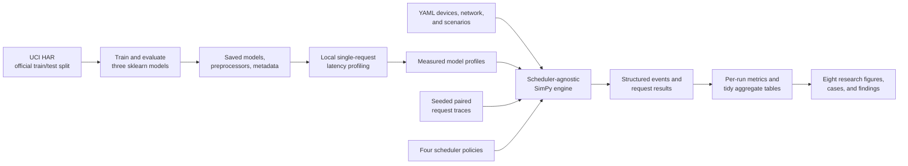

# EdgeWeaver

EdgeWeaver is a local research prototype for studying how inference requests should be assigned
across simulated heterogeneous edge devices when deadlines, model accuracy, queueing, network delay,
and estimated energy all matter. It provides a reproducible command-line workflow from the UCI Human
Activity Recognition (HAR) dataset through model training, local profiling, SimPy simulation,
scheduler comparison, ablations, metrics, figures, and research findings.

This is a simulation study, not production edge infrastructure. Only model inference on the profiling
computer was physically timed. The mobile, gateway, edge server, remote links, slowdowns, and energy
values are simulated.

## Research workflow



UCI HAR supplies 561-feature sensor samples for six activities. Three scikit-learn models are trained
against its predefined split:

| Role | Model | Test accuracy | Macro F1 | Measured mean single-request latency |
|---|---|---:|---:|---:|
| Light | Logistic regression | 95.49% | 95.48% | 0.246 ms |
| Balanced | Random forest | 92.84% | 92.64% | 12.660 ms |
| Heavy | MLP | 94.57% | 94.58% | 0.336 ms |

These measurements came from one Windows computer using 500 timed predictions per model. They are
stored inputs to simulation; simulation never profiles models at runtime.

The four policies share one scheduler interface:

- **Round Robin** rotates through compatible devices and selects that device's fastest qualifying
  model without considering queues or network conditions.
- **Fastest Device** selects the device with the lowest isolated inference time and its most accurate
  compatible model, deliberately ignoring congestion.
- **Minimum Completion Time (MCT)** chooses the compatible, accuracy-eligible pair with the earliest
  predicted completion after queue, network, and inference time.
- **EdgeWeaver** selects the lowest estimated-energy candidate among those predicted to meet the
  deadline, falls back to earliest completion if none can, and updates per-device/model execution
  estimates using a causal EWMA after inference completes.

## Install

Python 3.12 or newer is required.

```bash
python -m venv .venv
python -m pip install --upgrade pip
python -m pip install -e ".[dev]"
```

For the exact direct dependency versions used by the completed study, install with
`python -m pip install -c constraints.txt -e ".[dev]"`. On an incompatible environment, retrain the
`joblib` artifacts instead of assuming cross-version scikit-learn compatibility.

Run the commands below from the repository root. Script defaults are resolved from each script's
location rather than an ambient machine-specific path; explicit path flags support custom locations.

## Reproduce the workflow

Dataset preparation, training, and profiling are one-time or intentionally repeated measurement
steps. The raw dataset and `joblib` files are generated locally rather than required by ordinary
unit tests.

```bash
# Download/reuse and validate the official UCI HAR dataset.
python scripts/download_uci_har.py

# Train/evaluate three models and verify saved-artifact prediction reload.
python scripts/train_models.py
python scripts/verify_models.py

# Physically re-profile this computer (overwrites measured profiles).
python scripts/profile_models.py --predictions 500
```

Run one scenario entirely from the CLI:

```bash
python scripts/run_simulation.py --scenario bursty --scheduler edgeweaver --seed 1
```

Run or safely resume the complete study—80 core runs plus 10 scoped ablation runs—and regenerate all
analysis products:

```bash
python scripts/run_experiments.py
python scripts/run_experiments.py --validate-only
```

Regenerate tables, figures, failure cases, and findings from validated saved runs without rerunning
any simulation:

```bash
python scripts/generate_research_outputs.py
```

Run the normal test and quality checks without downloading or retraining:

```bash
pytest
ruff check edgeweaver scripts tests
ruff format --check edgeweaver scripts tests
mypy edgeweaver scripts/run_simulation.py scripts/run_experiments.py \
  scripts/generate_research_outputs.py
```

## Results

The completed study contains 80/80 core runs using seeds 1–5 and 10/10 planned ablation runs. Every
scenario/seed pair reused one trace across schedulers. Mean results across five seeds showed:

- Under network slowdown, deadline satisfaction was 100% for MCT and EdgeWeaver, 93.66% for Round
  Robin, and 79.90% for Fastest Device. Corresponding mean end-to-end latencies were 0.616, 0.616,
  50.257, and 124.231 ms, respectively.
- All four schedulers averaged 100% deadline satisfaction in normal, bursty, and device-slowdown
  conditions. Fastest Device did queue work during bursts, but the observed queueing was too small to
  reduce its deadline rate.
- Every policy selected logistic regression for every assigned request because it was the measured
  most-accurate model and also the lowest-compute practical choice. Consequently, both EdgeWeaver
  ablations matched the full policy on the tested metrics: H3 and H4 were inconclusive because model
  choices did not differ, and H5 was inconclusive because EdgeWeaver did not use the slowed edge
  server.
- One of five requested representative case types—a remote network-slowdown miss—was observed. The
  saved case report marks the four absent types explicitly rather than manufacturing evidence.

No parameters, seeds, measured profiles, or valid results were altered or discarded to make a
hypothesis succeed. See [the report](docs/report.md), [methodology](docs/methodology.md),
[findings](experiments/phase7/results/findings_summary.md), and
[aggregate tables](experiments/phase7/results/tables/aggregate_results.csv).

## Repository structure

```text
edgeweaver/               ML, simulation, schedulers, scenarios, metrics, experiments, analysis
configs/                  Devices, network, simulation, scenarios, and experiment matrix
scripts/                  Dataset, training, profiling, simulation, experiment, analysis CLIs
artifacts/models/         Generated trained models, preprocessors, and metadata
artifacts/profiles/       Measured profiles, raw timing observations, environment metadata
experiments/phase7/       Paired traces, raw runs/events, summaries, tables, figures, findings
tests/                    Fast unit, integration, determinism, scheduler, and export tests
docs/                     Methodology, report, demo script, status, and QA handoffs
```

## Limitations

- Only one physical computer was profiled; all other devices use simulated scaling factors.
- Energy is an estimated normalized quantity, not measured electricity or joules.
- Overall test accuracy is used as an approximation for per-request scheduling eligibility.
- Network behavior is a simplified latency/bandwidth model without packet or transport effects.
- UCI HAR covers one sensor-classification domain and does not establish general ML behavior.
- The simulator omits many operating-system, concurrency, thermal, and hardware effects.
- Five seeds describe this configured study but provide limited statistical resolution.
- These results do not prove that EdgeWeaver works on production edge infrastructure.

The project is fully usable from the command line. A local React presentation interface and minimal
FastAPI bridge are intentionally deferred to Phase 9 and are not represented as implemented here.
