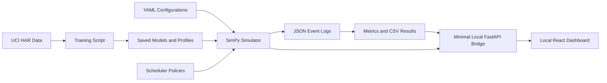

# EdgeWeaver: Simplified Project Plan

## 1. Project Summary

**EdgeWeaver** is a local research prototype for studying how machine-learning inference requests should be assigned to simulated edge devices with different speeds, energy costs, queues, and network delays.

The project will use one public sensor dataset, train three ordinary machine-learning models, measure their real local accuracy and inference latency, and then use those measurements inside a discrete-event simulation. Several scheduling policies will be compared under normal load, bursty load, network slowdown, and device slowdown.

The final product will be:

- A Python simulation package
- A command-line experiment runner
- Reproducible experiment configurations
- Result tables and charts
- A small local frontend created in React at the end
- A concise research-style report

The project will **not** be deployed and will not support real users, real edge-device clusters, user accounts, cloud infrastructure, or production workloads.

---

## 2. One-Sentence Goal

> Build and evaluate a simple scheduler that chooses a device and model for each inference request while considering deadlines, model accuracy, queue delay, network delay, and estimated energy.

---

## 3. Why This Project Is Useful

AgentTrace demonstrates trustworthy AI-agent engineering. RAGScope demonstrates observable RAG research. EdgeWeaver will demonstrate a different group of skills:

- Machine-learning model training
- Inference profiling
- Distributed-systems thinking
- Scheduling algorithms
- Discrete-event simulation
- Resource constraints
- Quantitative experimentation
- Statistical comparison
- Research reporting

This provides breadth without copying the MITACS projects on federated learning, IoT cybersecurity, digital-twin contract generation, or local health coaching.

---

## 4. Main Research Question

> Does a deadline- and resource-aware scheduler complete more useful inference requests than simple scheduling policies when edge devices experience changing load and network conditions?

## 4.1 Secondary questions

- When is local inference better than sending a request to a faster remote device?
- Does choosing a smaller model help during traffic bursts?
- Does always using the fastest device overload it?
- How badly do static scheduling policies behave when a device slows down?
- What accuracy, latency, and energy trade-offs are created by model switching?

---

## 5. Research Hypotheses

### H1

The fastest-device policy will perform well at low load but will create long queues during bursts.

### H2

A minimum-completion-time scheduler will meet more deadlines than round robin.

### H3

EdgeWeaver will meet more deadlines during bursts by selecting smaller models when necessary.

### H4

EdgeWeaver will use less estimated energy than an accuracy-first scheduler while maintaining acceptable prediction quality.

### H5

Updating device-speed estimates from recent observations will help EdgeWeaver respond to device slowdowns.

---

## 6. Fixed Project Scope

The project should contain only the following core components.

### Machine-learning component

- One public dataset
- Three trained model variants
- Accuracy evaluation
- Local single-request latency profiling
- Saved model profiles

### Simulation component

- Three simulated devices
- Simple network-delay model
- Inference request generator
- Device queues
- Four scheduling policies
- Four workload scenarios
- Seeded, reproducible simulation

### Research component

- Configuration-driven experiments
- Metrics collection
- Scheduler comparison
- Simple ablation study
- Charts
- Failure-case analysis

### Interface component

- One local React application
- One minimal FastAPI bridge between React and the Python simulation package
- Configure and run a simulation
- View device queues and assignments after a run
- Compare scheduler results
- Inspect individual scheduling decisions

---

## 7. Explicitly Out of Scope

Do not add these features:

- Cloud deployment
- User accounts or authentication
- A production REST API or production backend architecture
- Server-side rendering or a Next.js application
- Kubernetes
- Real distributed devices
- Raspberry Pi or mobile-device requirements
- Federated learning
- Model aggregation
- LLMs or RAG
- Reinforcement learning
- Multi-agent systems
- Real electricity measurement
- Real network packet simulation
- Hardware purchasing
- Complex digital twins
- Live multi-user collaboration
- More than one core dataset
- More than three core model variants

If time remains after the complete project is working, optional extensions may be considered. They must not be part of the initial implementation plan.

---

## 8. Dataset

Use the **UCI Human Activity Recognition Using Smartphones** dataset.

The dataset contains smartphone accelerometer and gyroscope measurements for six activities:

- Walking
- Walking upstairs
- Walking downstairs
- Sitting
- Standing
- Lying down

It is suitable because:

- It represents sensor-based edge inference.
- It is small enough to train quickly.
- It has a predefined train/test split.
- It does not require image or audio preprocessing.
- It contains enough features for several model types.
- It avoids medical diagnosis or safety claims.

Dataset source:

- [UCI Human Activity Recognition Using Smartphones](https://archive.ics.uci.edu/dataset/240/humanactivityrecognitionusingsmartphones)

---

## 9. Model Variants

Train three simple scikit-learn models. Their names describe computational roles, not guaranteed accuracy order.

## 9.1 Light model

Recommended model:

- Logistic regression

Purpose:

- Small and fast baseline
- Low inference cost
- Suitable for constrained devices

## 9.2 Balanced model

Recommended model:

- Random forest with a moderate number of trees

Purpose:

- Intermediate compute profile
- Different model family
- Often strong tabular-data performance

## 9.3 Heavy model

Recommended model:

- Multi-layer perceptron with one or two hidden layers

Purpose:

- Higher compute and memory profile
- Represents a more expensive inference option

## 9.4 Important rule

Do not manually label one model as more accurate. Train all models and store their measured test accuracy. The scheduler must use the measured values.

If the heavy model is not more accurate than the others, that is a valid result. Hyperparameters may be adjusted reasonably, but results must not be manipulated merely to create the expected ordering.

---

## 10. Model Training Pipeline

The training script should perform these steps:

1. Download or load the dataset.
2. Validate expected files and columns.
3. Load the predefined training and test split.
4. Apply feature scaling where required.
5. Train the three models.
6. Evaluate each model on the same test set.
7. Record accuracy and macro F1 score.
8. Save the fitted preprocessing object.
9. Save each trained model with `joblib`.
10. Write a model-profile JSON file.

Example model profile:

```json
{
  "model_id": "logistic-regression-v1",
  "display_name": "Light Model",
  "accuracy": 0.91,
  "macro_f1": 0.90,
  "model_size_bytes": 120000,
  "local_latency_ms_mean": 0.42,
  "local_latency_ms_p95": 0.57
}
```

The numbers above are examples only and must not be hard-coded as experimental results.

---

## 11. Local Inference Profiling

Profile every trained model on the local computer.

## 11.1 Profiling method

For each model:

1. Load the model before timing begins.
2. Warm it up with several predictions.
3. Select individual test examples.
4. Time one prediction at a time.
5. Repeat for at least 500 predictions.
6. Use `time.perf_counter_ns()`.
7. Store mean, median, standard deviation, and P95 latency.
8. Record model file size.
9. Record the computer and Python environment in a metadata file.

## 11.2 Why single-request profiling is used

The simulator models interactive sensor requests rather than offline batch prediction. Batch throughput is not the main metric.

## 11.3 Profiling limitation

Only one computer is physically measured. Other simulated devices will use documented speed multipliers based on this local profile. The report must clearly distinguish measured latency from simulated latency.

---

## 12. Simulated Devices

Use exactly three default device profiles.

## 12.1 Mobile device

Characteristics:

- Request origin
- Slowest inference
- No network delay for local execution
- Lowest power multiplier
- Can run only the light and balanced models by default

Example configuration:

```yaml
id: mobile
speed_multiplier: 2.5
active_power_units: 1.0
queue_capacity: 20
supported_models:
  - light
  - balanced
```

## 12.2 Edge gateway

Characteristics:

- Faster than the mobile device
- Moderate network delay
- Can run all models
- Moderate power multiplier

Example configuration:

```yaml
id: gateway
speed_multiplier: 1.3
active_power_units: 2.0
queue_capacity: 40
supported_models:
  - light
  - balanced
  - heavy
```

## 12.3 Edge server

Characteristics:

- Fastest inference
- Highest network delay
- Highest power multiplier
- Can run all models
- Shared resource likely to become congested

Example configuration:

```yaml
id: edge-server
speed_multiplier: 0.6
active_power_units: 4.0
queue_capacity: 80
supported_models:
  - light
  - balanced
  - heavy
```

These are starting configurations, not research results. They should be editable through YAML files.

---

## 13. Network Model

Use a deliberately simple network model.

Each remote device should have:

- Base one-way latency
- Bandwidth
- Optional jitter

Example:

```yaml
mobile_to_gateway:
  base_latency_ms: 12
  bandwidth_mbps: 20

mobile_to_edge_server:
  base_latency_ms: 35
  bandwidth_mbps: 10
```

Approximate transfer time:

```text
transfer_time = base_latency + input_size_bits / bandwidth_bits_per_second
```

For local execution:

```text
network_time = 0
```

Do not simulate packets, routing protocols, retransmission, or real sockets.

---

## 14. Inference Request

Each simulated request should contain:

```python
class InferenceRequest:
    request_id: str
    arrival_time_ms: float
    deadline_ms: float
    minimum_accuracy: float
    input_size_bytes: int
    source_device_id: str
    true_label: int
    feature_vector_id: int
```

## 14.1 Deadline meaning

The deadline is relative to request arrival.

Example:

```text
arrival time: 1,000 ms
deadline: 150 ms
absolute completion deadline: 1,150 ms
```

## 14.2 Minimum accuracy

The minimum accuracy is a scheduling constraint based on the model's measured overall test accuracy.

This is an approximation. Overall model accuracy does not guarantee correctness for an individual request. The limitation must be documented.

---

## 15. End-to-End Request Time

For a selected device and model:

```text
total_time = upload_time
           + queue_wait_time
           + inference_time
           + return_time
           + scheduler_overhead
```

A request meets its deadline when:

```text
completion_time <= arrival_time + deadline
```

---

## 16. Simple Energy Estimate

The project will use **normalized energy units**, not claimed physical joules.

For compute:

```text
compute_energy = active_power_units * inference_time_ms
```

For transfer:

```text
network_energy = transferred_kilobytes * network_energy_per_kilobyte
```

Total:

```text
estimated_energy = compute_energy + network_energy
```

Every chart and report must label this as estimated or normalized energy.

---

## 17. Scheduler Interface

All schedulers should implement a common interface.

```python
class Scheduler(Protocol):
    name: str

    def select_assignment(
        self,
        request: InferenceRequest,
        state: SimulationState,
    ) -> AssignmentDecision:
        ...
```

The decision should include:

```python
class AssignmentDecision:
    request_id: str
    device_id: str
    model_id: str
    predicted_completion_ms: float
    predicted_energy_units: float
    predicted_model_accuracy: float
    expected_to_meet_deadline: bool
    decision_reason: str
```

---

## 18. Scheduling Policies

Implement exactly four core policies.

## 18.1 Round Robin

Behaviour:

- Rotate between compatible devices.
- Select the fastest compatible model meeting minimum accuracy on that device.
- Ignore queue length and network conditions.

Purpose:

- Very simple baseline

## 18.2 Fastest Device

Behaviour:

- Select the device with the lowest isolated inference time for the highest-accuracy compatible model.
- Ignore current queue length.

Purpose:

- Demonstrate that the apparently fastest node may become overloaded.

## 18.3 Minimum Completion Time

Behaviour:

- Estimate network, queue, and inference time for every compatible device/model pair.
- Filter out models below minimum accuracy.
- Select the pair with the earliest predicted completion.

Purpose:

- Strong latency-aware baseline

## 18.4 EdgeWeaver

Behaviour:

1. Generate all compatible device/model pairs.
2. Remove pairs whose model accuracy is below the request minimum.
3. Predict completion time and energy for every remaining pair.
4. Find candidates predicted to meet the deadline.
5. If one or more candidates are feasible, choose the feasible candidate with the lowest estimated energy.
6. If energy values tie, choose the earliest predicted completion.
7. If no candidate can meet the deadline, choose the candidate with the earliest predicted completion.
8. After execution, update the chosen device/model latency estimate using recent observations.

Purpose:

- Investigate deadline-aware model switching and simple online adaptation

## 18.5 EdgeWeaver is intentionally simple

Do not add:

- Reinforcement learning
- Genetic algorithms
- Neural schedulers
- Multi-objective solvers
- Complicated weighted formulas

The research value comes from controlled comparison and failure analysis, not algorithmic complexity.

---

## 19. Online Latency Update

Use an exponentially weighted moving average:

```text
new_estimate = alpha * observed_latency
             + (1 - alpha) * old_estimate
```

Use a configurable `alpha`, initially `0.2`.

Only EdgeWeaver needs this update for the core comparison.

Store:

- Old estimate
- Observed latency
- New estimate
- Simulation time
- Device and model

---

## 20. Workload Generation

Requests should use real feature vectors and labels sampled from the test set.

Each workload configuration defines:

- Simulation duration
- Arrival pattern
- Request count or arrival rate
- Deadline distribution
- Minimum-accuracy distribution
- Random seed

Use the same generated request trace for every scheduler in an experiment.

Save request traces as JSON or CSV so they can be replayed.

---

## 21. Four Core Scenarios

## 21.1 Normal Load

Purpose:

- Establish behaviour when queues are short.

Characteristics:

- Moderate request rate
- Stable devices
- Stable network
- Relaxed mixture of deadlines

## 21.2 Bursty Load

Purpose:

- Test queue awareness and model switching.

Characteristics:

- Low normal arrival rate
- Two or three short periods of high request arrivals
- Stable device performance

## 21.3 Network Slowdown

Purpose:

- Test whether remote offloading remains useful.

Characteristics:

- Normal load
- Edge-server network latency increases during the middle of the simulation
- Gateway connection remains stable

## 21.4 Device Slowdown

Purpose:

- Test online latency updates.

Characteristics:

- Normal or moderately high load
- Edge server becomes slower during the middle of the simulation
- Performance later returns to normal

---

## 22. Event Log

The simulator should produce a structured event log.

Required event types:

- `REQUEST_ARRIVED`
- `SCHEDULER_DECISION`
- `REQUEST_QUEUED`
- `INFERENCE_STARTED`
- `INFERENCE_COMPLETED`
- `REQUEST_RETURNED`
- `DEADLINE_MISSED`
- `DEVICE_SLOWDOWN_STARTED`
- `DEVICE_SLOWDOWN_ENDED`
- `NETWORK_SLOWDOWN_STARTED`
- `NETWORK_SLOWDOWN_ENDED`
- `PROFILE_UPDATED`

Each event should contain:

- Simulation timestamp
- Request ID where applicable
- Device ID where applicable
- Model ID where applicable
- Relevant event details

The log is the source for metrics and frontend inspection.

---

## 23. Required Metrics

Keep the metric set small and interpretable.

## 23.1 Deadline satisfaction rate

```text
requests completed before deadline / total completed requests
```

## 23.2 Useful goodput

```text
valid predictions meeting deadline and accuracy constraint
/ simulation duration
```

## 23.3 Mean and P95 latency

Measure end-to-end request latency.

## 23.4 Actual prediction accuracy

Use the model's prediction and the sampled test-set label.

## 23.5 Estimated energy per completed request

Use normalized energy units.

## 23.6 Device utilization

For each device:

```text
busy simulation time / total simulation time
```

## 23.7 Model-selection distribution

Report the percentage of requests assigned to each model.

## 23.8 Deadline misses by cause

Classify deadline misses as primarily caused by:

- Network delay
- Queue delay
- Inference time
- Incorrect static estimate

This classification can use the largest latency component or a documented rule.

---

## 24. Experiment Design

Use:

- 4 schedulers
- 4 scenarios
- 5 random seeds

Total:

```text
4 * 4 * 5 = 80 simulation runs
```

This is large enough for comparison and small enough to run locally.

## 24.1 Controlled variables

For paired runs, keep constant:

- Request trace
- Dataset samples
- Device profiles
- Network configuration
- Model profiles
- Simulation duration
- Random seed

Only the scheduler should change.

## 24.2 Main comparisons

For every scenario, compare:

- Deadline satisfaction
- Useful goodput
- Mean latency
- P95 latency
- Accuracy
- Energy estimate
- Device utilization
- Model-selection distribution

---

## 25. Small Ablation Study

Perform only two EdgeWeaver ablations.

## 25.1 No model switching

EdgeWeaver must always choose the most accurate compatible model.

Question:

- How much does model switching contribute during bursts?

## 25.2 No online latency update

EdgeWeaver uses only original static latency profiles.

Question:

- Does online updating help during device slowdown?

Run these ablations only in the scenarios where they are relevant. A complete combinatorial experiment is unnecessary.

---

## 26. Statistical Analysis

For each scheduler and scenario, report:

- Mean across seeds
- Standard deviation across seeds
- Individual seed values

Optional:

- 95% bootstrap confidence interval

Avoid complicated statistical tests unless they are understood and correctly justified.

The primary report can use tables, error bars, and careful discussion of effect sizes.

---

## 27. Required Charts

Create these charts from experiment results:

1. Deadline satisfaction by scheduler and scenario
2. Useful goodput by scheduler and scenario
3. Mean and P95 latency
4. Actual accuracy
5. Estimated energy per completed request
6. Device-utilization heatmap
7. Model-selection distribution
8. EdgeWeaver ablation comparison

Every chart must include:

- Metric name
- Units
- Scheduler names
- Scenario names
- Number of seeds or runs
- Clear note that energy is estimated

---

## 28. Simple Application Architecture



The FastAPI bridge exists only because the browser cannot directly execute the Python simulator. It should expose a few local endpoints for starting a simulation and reading saved models, configurations, events, and results. There is no authentication layer, message queue, cloud component, production database, or production backend architecture.

---

## 29. Recommended Technology Stack

### Core language

- Python 3.12+

### Machine learning

- scikit-learn
- pandas
- NumPy
- joblib

### Simulation

- SimPy

### Configuration and validation

- YAML
- Pydantic

### Analysis

- pandas
- matplotlib
- seaborn
- optional SciPy

### Frontend

- React with Vite
- TypeScript
- Plotly, Recharts, or another lightweight React chart library

### Local API bridge

- FastAPI
- Pydantic request and response models
- Direct calls into the existing Python simulation package
- No duplicated scheduling or metrics logic inside the API layer

### Testing

- pytest
- Ruff
- mypy for core models and scheduling logic

---

## 30. Suggested Repository Structure

```text
edgeweaver/
├── api/
│   ├── main.py
│   ├── routes.py
│   └── schemas.py
├── edgeweaver/
│   ├── config.py
│   ├── domain.py
│   ├── devices.py
│   ├── network.py
│   ├── workloads.py
│   ├── simulation.py
│   ├── events.py
│   ├── metrics.py
│   ├── experiments.py
│   ├── schedulers/
│   │   ├── base.py
│   │   ├── round_robin.py
│   │   ├── fastest_device.py
│   │   ├── min_completion.py
│   │   └── edgeweaver.py
│   └── ml/
│       ├── data.py
│       ├── train.py
│       └── profile.py
├── frontend/
│   ├── src/
│   │   ├── api/
│   │   ├── components/
│   │   ├── pages/
│   │   ├── types/
│   │   ├── App.tsx
│   │   └── main.tsx
│   ├── package.json
│   ├── tsconfig.json
│   └── vite.config.ts
├── configs/
│   ├── devices.yaml
│   ├── network.yaml
│   ├── normal.yaml
│   ├── bursty.yaml
│   ├── network_slowdown.yaml
│   └── device_slowdown.yaml
├── data/
│   ├── raw/
│   └── processed/
├── artifacts/
│   ├── models/
│   ├── profiles/
│   └── workload_traces/
├── experiments/
│   ├── raw/
│   ├── results/
│   └── figures/
├── tests/
├── docs/
│   ├── methodology.md
│   └── report.md
├── scripts/
│   ├── train_models.py
│   ├── profile_models.py
│   ├── run_simulation.py
│   └── run_experiments.py
├── README.md
└── pyproject.toml
```

---

## 31. React Frontend

Build the frontend only after the simulator and experiments work from the command line.

Use React with Vite and TypeScript. The interface is a local presentation layer, not a production web application. It should call a minimal FastAPI service running on the same computer.

## 31.1 Minimal Local API

Only implement the endpoints needed by the interface:

- `GET /api/project` returns project and research metadata.
- `GET /api/models` returns saved model profiles.
- `GET /api/scenarios` returns available scenario configurations.
- `GET /api/schedulers` returns scheduler names and descriptions.
- `POST /api/simulations` runs one configured simulation and returns its run ID and summary.
- `GET /api/simulations/{run_id}` returns one saved run summary.
- `GET /api/simulations/{run_id}/events` returns the event log.
- `GET /api/experiments/results` returns saved aggregate experiment results.

The API must call the same simulation and metrics functions used by the command-line scripts. Do not reimplement research logic in route handlers.

## 31.2 Page 1: Project Overview

Show:

- Research question
- Device descriptions
- Model profiles
- Scheduler descriptions
- System diagram

## 31.3 Page 2: Run One Simulation

Controls:

- Scenario
- Scheduler
- Random seed
- Request count or duration
- Run button

Results:

- Summary metrics
- Requests per device
- Models selected
- Deadline results
- Device utilization

## 31.4 Page 3: Decision Inspector

Allow selection of one request and show:

- Arrival time
- Deadline
- Minimum accuracy
- Candidate device/model pairs
- Predicted completion
- Predicted energy
- Chosen assignment
- Decision reason
- Actual completion time
- Whether deadline was met
- Actual prediction result

## 31.5 Page 4: Compare Schedulers

Show saved experiment results:

- Deadline satisfaction
- Useful goodput
- Latency
- Accuracy
- Energy estimate
- Utilization

## 31.6 Page 5: Failure Cases

Show examples such as:

- Fastest device overloaded during a burst
- Remote execution harmed by network slowdown
- Static estimate failed after device slowdown
- EdgeWeaver selected a smaller model to meet a deadline
- No available assignment could meet a deadline

No login, database-backed user preferences, server-side rendering, or administrative interface is needed.

---

## 32. Implementation Phases

## Phase 1: Project Foundation

Tasks:

1. Create the repository structure.
2. Configure Python dependencies.
3. Add Ruff, pytest, and mypy.
4. Define Pydantic configuration models.
5. Define domain objects for devices, models, requests, and decisions.

Deliverable:

- Valid configurations can be loaded and tested.

## Phase 2: Dataset and Models

Tasks:

1. Download and validate UCI HAR.
2. Create reproducible preprocessing.
3. Train the three models.
4. Evaluate accuracy and macro F1.
5. Save models and preprocessing.
6. Record model metadata.

Deliverable:

- Three reproducibly trained model artifacts.

## Phase 3: Model Profiling

Tasks:

1. Implement warm-up predictions.
2. Measure at least 500 individual predictions per model.
3. Calculate summary statistics.
4. Save profile JSON.
5. Record local machine metadata.

Deliverable:

- Real local latency and model-size profiles.

## Phase 4: Basic Simulator

Tasks:

1. Create a SimPy environment.
2. Create device resources and queues.
3. Generate requests.
4. Simulate local and remote execution.
5. Record structured events.

Deliverable:

- One fixed scheduler can complete a repeatable simulation.

## Phase 5: Baseline Schedulers

Tasks:

1. Define common scheduler interface.
2. Implement round robin.
3. Implement fastest device.
4. Implement minimum completion time.
5. Test every scheduler on the same request trace.

Deliverable:

- Three working baselines with unit tests.

## Phase 6: EdgeWeaver Scheduler

Tasks:

1. Generate compatible assignments.
2. Enforce minimum accuracy.
3. Estimate completion and energy.
4. Choose lowest-energy feasible assignment.
5. Implement earliest-completion fallback.
6. Add online latency update.
7. Record decision explanations.

Deliverable:

- Reproducible EdgeWeaver decisions with tests.

## Phase 7: Scenarios and Metrics

Tasks:

1. Implement four scenario configurations.
2. Add slowdown events.
3. Calculate all required metrics.
4. Add deadline-miss causes.
5. Export events and run summaries.

Deliverable:

- Each scenario runs with each scheduler.

## Phase 8: Experiment Runner

Tasks:

1. Generate identical workload traces for paired runs.
2. Run the 80-run experiment matrix.
3. Support resume after interruption.
4. Store raw events separately from summaries.
5. Generate tidy CSV results.

Deliverable:

- One command reproduces the core experiment.

## Phase 9: Analysis

Tasks:

1. Aggregate results across seeds.
2. Generate required charts.
3. Run two ablations.
4. Identify representative failure cases.
5. Write cautious findings.

Deliverable:

- Reproducible figures and result tables.

## Phase 10: React Frontend

Tasks:

1. Add the minimal FastAPI bridge over the existing Python package.
2. Create a React application using Vite and TypeScript.
3. Build the overview page.
4. Build the single-simulation page.
5. Build the decision inspector.
6. Build the scheduler comparison.
7. Build the failure-case page.
8. Add basic loading, empty, and error states.

Deliverable:

- A local React presentation interface over the working simulation code.

## Phase 11: Documentation and Final Review

Tasks:

1. Write README.
2. Document simulation assumptions.
3. Document measured versus simulated values.
4. Write methodology.
5. Write four-to-six-page report.
6. Record demonstration video.
7. Run clean-environment reproducibility check.

Deliverable:

- Portfolio-ready repository and research report.

---

## 33. Testing Requirements

## 33.1 Unit tests

Test:

- Configuration validation
- Network-time calculation
- Simulated inference-time calculation
- Energy calculation
- Deadline calculation
- Candidate compatibility
- Every scheduler decision
- Online latency update
- Metrics

## 33.2 Determinism tests

The same:

- Configuration
- Workload trace
- Scheduler
- Random seed

must produce identical event order and summary metrics.

Small timing differences from real profiling are acceptable only during profiling, not during simulation replay.

## 33.3 Scheduler fixture tests

Create small manually understandable states:

- One empty device and one congested device
- One fast remote device with poor network
- Tight deadline requiring light model
- Accuracy constraint excluding light model
- No feasible deadline assignment
- Device slowdown requiring profile update

Assert the expected scheduler choice.

## 33.4 Integration test

One automated integration test should:

1. Load fixture model profiles.
2. Load a small scenario.
3. Generate a fixed workload.
4. Run all schedulers.
5. Export results.
6. Confirm required metrics exist.

Tests should not retrain models unless explicitly requested.

---

## 34. Research Report Structure

1. Abstract
2. Introduction
3. Motivation and related work
4. System model
5. Scheduling policies
6. Dataset and model profiles
7. Experimental methodology
8. Results
9. EdgeWeaver ablations
10. Failure analysis
11. Threats to validity
12. Limitations
13. Conclusion

---

## 35. Required Limitations

The final report must explicitly state:

- Only one physical computer was profiled.
- Other devices are simulated using scaling factors.
- Energy values are estimates or normalized units.
- Overall model accuracy is used as a scheduling approximation.
- Network behaviour is simplified.
- UCI HAR represents only one ML domain.
- The simulator does not reproduce all real operating-system or hardware effects.
- Results do not prove the policy works on production edge infrastructure.

These limitations do not weaken the project when they are stated honestly. They define the boundary of the experiment.

---

## 36. Definition of Completion

The project is complete when:

- UCI HAR preprocessing is reproducible.
- Three models are trained and saved.
- Model accuracy and local latency are measured.
- Three device profiles are defined.
- Network delay is simulated.
- Four schedulers use one common interface.
- Four seeded scenarios work.
- The 80-run experiment completes.
- Two EdgeWeaver ablations are completed.
- Required metrics and charts are generated.
- Event logs and scheduling decisions are inspectable.
- The React application presents results locally through the minimal FastAPI bridge.
- Unit, integration, and determinism tests pass.
- The README and research report distinguish measured and simulated values.

---

## 37. Final Portfolio Deliverables

- Python source code
- Three trained-model scripts and reproducible artifacts
- Local profiling results
- Simulation configurations
- Four scheduler implementations
- Saved workload traces
- Raw experiment logs
- Tidy result tables
- Eight core charts
- React and TypeScript presentation interface
- Minimal local FastAPI bridge
- Architecture diagram
- README
- Methodology document
- Four-to-six-page report
- Short demonstration video

---

## 38. Recommended Demonstration

Use one short, clear story:

1. Show the three models and their measured accuracy and latency.
2. Show the mobile, gateway, and edge-server profiles.
3. Run the bursty scenario using Fastest Device.
4. Show the edge server becoming congested and missing deadlines.
5. Replay the identical workload using EdgeWeaver.
6. Inspect one request where EdgeWeaver selected a lighter model.
7. Show the deadline, accuracy, and estimated-energy difference.
8. Open the aggregate comparison across all seeds.
9. Show one scenario where a simpler scheduler performs similarly or better.
10. Finish with the exact conditions under which EdgeWeaver helps.

This demonstration is enough to communicate the complete project without deployment or real users.

---

## 39. First Implementation Session

Complete these tasks first:

1. Create the repository structure.
2. Create Pydantic models for model profiles, devices, networks, requests, and scenarios.
3. Add example YAML configurations for the three devices and two network links.
4. Create a tiny hard-coded model profile fixture.
5. Build a SimPy simulation with one device and five requests.
6. Record arrival, queue, start, and completion events.
7. Calculate latency and deadline success.
8. Add deterministic tests for the five-request simulation.

Do not begin the frontend, experiment dashboard, or advanced scheduling until this small simulation is correct.
